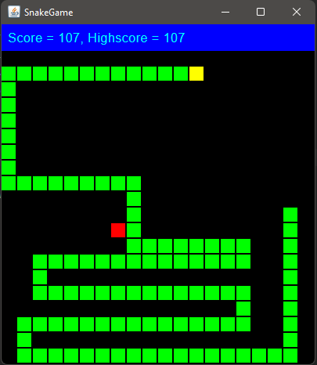

# A Snake game, built with Compose for Desktop

`snake-compose-for-desktop` is my implementation of the classic Snake game using [Compose for Desktop](https://www.jetbrains.com/lp/compose/). Run with `./gradlew run` or build and run a stand-alone jar with `./gradlew build; java -jar build/libs/snake-compose-for-desktop-executable-1.0.jar`.

Use the arrow keys to move the snake around and `Esc` to quit the game. Collect the apples (red dots) but avoid hitting your own tail!

